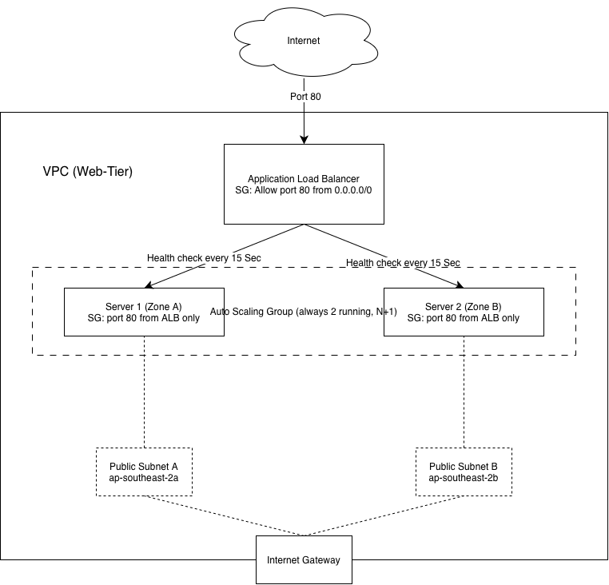

# Auto-healing web tier

> Terraform-managed AWS infrastructure for auto-healing web tier that can lose any single VM without downtime.

## Overview

This repository contains the Infrastructure as Code (IaC) for standing up a self-healing, N+1 web tier on AWS. It provisions a VPC, security groups, an Application Load Balancer and an Auto Scaling Group running a static NGINX web page across two Availability Zones, so the loss of any single instance causes zero downtime. One single terraform apply command stands everything up and a second run makes no further changes.

## Why AWS?

AWS is the platform I'm most comfortable and experienced with along with Terraform. The requirement to automatically replace a terminated instance is achieved using an AWS Auto Scaling Group with health_check_type = "ELB". This allows the Auto Scaling Group to detect an unhealthy instance through the load balancer’s health checks and automatically replace it.

## Architecture Diagram





- Internet: sends requests to the Application Load Balancer on port 80, the only public entry point.
- ALB: splits traffic across 2 servers (Server 1 in Zone A and Server 2 in Zone B) checking each Zone's health every 15 seconds.
- Auto Scaling Group(dashed box): wraps both servers, always makes sure exactly 2 are running. If either fails its health check, it's replaced automatically this is the self-healing mechanism.
- Each server sits in its own Public Subnet, one per Availability Zone (2a and 2b), the physical N+1 redundancy.
- Both subnets connect out through one shared Internet Gateway, which lets traffic reach the internet.
- Everything (except Internet itself) sits inside one VPC, the network boundary for the whole project.

## Project Structure

```
main.tf, providers.tf, variables.tf, outputs.tf   # Root module, wires all 6 modules together
modules/
  01-vpc/                  # VPC, 2 public subnets, Internet Gateway, route table
  02-security-groups/      # ALB security group, web instance security group
  03-target-group/         # target group & health check
  04-launch-template/      # launch template & userdata.sh (installs/starts NGINX)
  05-load-balancer/        # Application Load Balancer & listener
  06-asg/                  # Auto Scaling Group
```

## Steps to run a plan and (optionally) an apply

```bash

terraform init
terraform plan

```

A second plan run with no changes shows zero changes. The only exception is the AMI lookup, which runs again each time. If a new AL2023 AMI is published between runs, Terraform will show a difference. This is expected behaviour, not a bug.

```bash

terraform apply

```

Running terraform apply to confirm that the infrastructure can be successfully provisioned.


## Assumptions

- Region: ap-southeast-2 (Sydney)

- No NAT Gateway or private subnets: EC2 instances run in public subnets and have public IPs. Their security groups only allow port 80 traffic from the ALB, so users cannot access them directly from the internet. A NAT Gateway would cost a lot for the budget.

- No HTTPS or ACM certificate: The project only needs a default web page. HTTPS would require a real domain name for certificate validation, which is not available.

- Fixed number of instances: No auto scaling is used. The setup uses N+1 instances so the website can keep running if one instance fails.

- AL2023 AMI: Using the latest Amazon Linux 2023 AMI with data "aws_ami" instead of using a fixed AMI ID.


## Estimated Monthly Cost (if fully deployed)

| Item | Est. monthly(AUD) |
| --- | --- |
| 2× t3.micro EC2 (24/7) | ~$21 (~$16 with Free Tier on one instance) |
| Application Load Balancer (base charge) | ~$27 |
| ALB LCU usage (low traffic)	| ~$1–2 |
| Data transfer	| ~$1 |
| **Total** |	**~$50–52 AUD/month** |

This is over the AUD $20 budget. The main reason being the ALB which costs about $27 AUD per month on its own.

